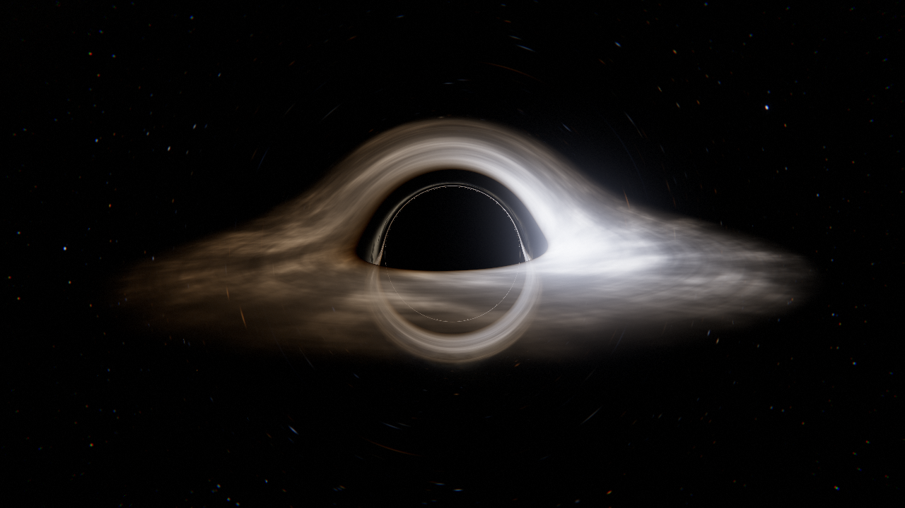
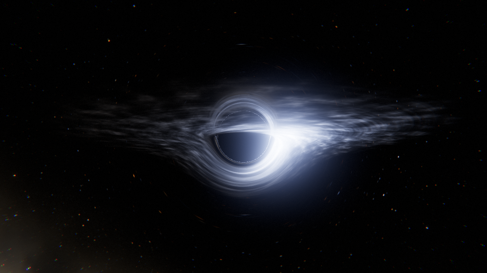
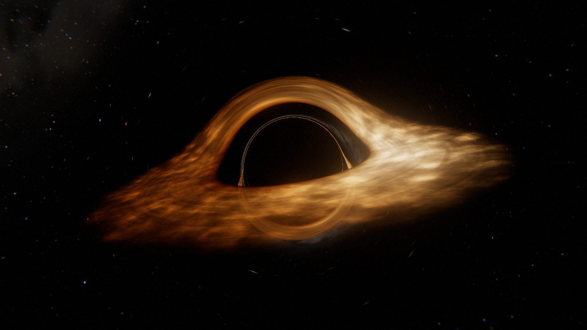
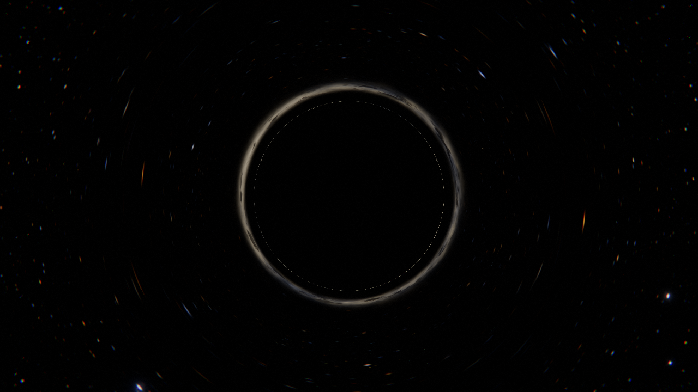

# GARGANTUA — Schwarzschild Black Hole Raytracer



A full-screen, interactive Schwarzschild black hole rendered entirely in a WebGL 2 fragment
shader. Every pixel integrates a null geodesic through curved spacetime; there are no meshes,
textures, images, or video. Three.js provides the renderer, render targets, OrbitControls and
the lil-gui panel. Native ES modules and an import map mean there is no build step.

Features: event horizon, photon ring, multi-crossing accretion disk with Doppler beaming and
gravitational redshift, animated turbulence with differential rotation, procedural lensed
starfield and Milky Way, HDR bloom, manual ACES tone mapping, vignette, film grain, subtle
chromatic aberration, cinematic camera paths, OrbitControls, four presets, telemetry HUD,
21 live parameters, debug views 0–9, hotkeys, optional synthesized audio, three quality
profiles, Retina-aware responsive rendering, persistence, WebGL context recovery, and a
URL-driven deterministic screenshot mode.

## Quick start

Requirements: a static file server with byte-range support for audio seeking and a browser with WebGL 2 (Chrome, Edge, Firefox,
Safari 15+). Node 18+ is only needed for the bundled server and the verification scripts.

```
cd black-star-poc
npm start                       # zero-dependency server on http://127.0.0.1:8080/
```

or run the bundled server directly:

```
node verify/serve.mjs 8080      # then open http://localhost:8080/
```

Open the URL and wait for "Compiling geodesic kernel…" to finish. The performance loads
its recording automatically. For the laboratory, open `?journey=off` and drag on the canvas
to take the camera.

## Exit Music performance

The page loads `media/exit-music.mp3` and starts the recording and journey together
from 0:00. If the browser blocks sound autoplay, the opening frame waits for **Start**;
there is no file-selection step. **Change recording** still lets you select another file.
The supplied recording is `14 - Radiohead - Exit Music (For a Film).mp3` (265.227 seconds),
copied to that local path. The `media/` directory remains ignored by Git; after cloning,
place your recording there or select it through the controls if the default is missing.
Use `?journey=off` to open the laboratory without loading or playing music. Deterministic
screenshot URLs never load or play a recording.

The camera approaches once, reveals the black hole early through a changing viewing
angle, and resolves the evolving disk before a concentrated plunge. After the crossing,
small directional streaks thin by decreasing their count to rare flashes on black.
**The interior is artistic imagery, not a physical simulation of a black-hole interior.**
The recording plays once, with its own recorded fade. After it ends, the visual tail
continues silently and indefinitely until **Stop**; neither the music nor approach loops.

**The crossing at 218 seconds is provisional and has not been calibrated by ear.** Open
**Timing cues**, scrub near the closing vocal climax, listen, and adjust **Crossing** and
**Plunge starts**. Apply the cues together: they must remain strictly ordered and inside
the recording, with the reveal complete in the first third. Invalid edits leave the last
valid cues active. A replacement recording preserves cue seconds and shows a duration
warning; shorter files require valid cues before Start. Cues and file selection are local
to the current page session. Reloading restores the provisional defaults.

The timeline seeks and reconstructs the scene even before starting. **Pause / Resume**
controls music and imagery together; **Restart** explicitly begins at zero. **Stop** returns
to the laboratory view and restores its camera and settings. Controls collapse on Start;
use the visible **Exit Music · controls** button or **G** to reopen them. During a performance:
**Space** pauses/resumes, **Esc** stops, **Q** changes quality, **F** toggles fullscreen, and
**S** saves a PNG. Camera dragging and laboratory preset/debug shortcuts are guarded.
GPU context loss pauses playback; after graphics recover, press **Resume** explicitly.

Capture any performance timestamp without a recording or playback:

```
?shot=1&journey=exit-music&t=52&seed=7&w=1280&h=720&quality=high
?shot=1&journey=exit-music&t=385.227&seed=7&w=1280&h=720&quality=high
```

`t` may continue past the recording end. A fixed timestamp and unsigned integer seed
reconstruct the same scene on the same GPU. Normal screenshot URLs retain their existing
behavior. Console automation is available under `window.__gargantua.journey`:
`state()`, `load(file)`, `start()`, `pause()`, `seek(seconds)`, `restart()`, `stop()`,
`setAnchors(anchors)`, and `capture(seconds, seed)` (explicit frozen, silent preview).
Recording seeks are limited to its duration; deterministic captures may sample any
finite nonnegative time, including the indefinite tail.

`npm run test:journey` checks scene and transport invariants. `npm run test:journey-browser`
uses generated WAV fixtures to check playback, seeks, the tail, GPU recovery, and phase
captures. `npm run verify` includes both suites and the existing raytracer regressions.
Generated captures live under ignored `verify/results/journey/`.

## Controls

| Key | Action |
| --- | --- |
| `0`–`9` | Debug view (see table below) |
| `[` / `]` | Previous / next preset |
| `C` | Cycle camera path (Orbit → Flyby → Plunge → Polar Rise → Free) |
| `Esc` or drag | Free camera with OrbitControls (drag to orbit, wheel to zoom) |
| `Space` | Pause / resume simulation time |
| `Q` | Cycle quality profile (Low → Medium → High) |
| `M` | Toggle synthesized audio |
| `H` | Toggle telemetry HUD |
| `G` | Toggle parameter panel |
| `K` or `?` | Toggle hotkey legend |
| `S` | Save a PNG of the current frame |
| `F` | Fullscreen |
| `T` | Reset simulation time |
| `R` | Reset parameters to the current preset |

### Debug views

| Key | View |
| --- | --- |
| 0 | Final composite |
| 1 | Raw HDR scene without post-processing |
| 2 | Bloom buffer |
| 3 | Redshift factor g of the first disk hit (blue < 1, white = 1, red > 1) |
| 4 | Disk crossing count (black 0, blue 1, green 2, yellow 3, orange 4, magenta 5+) |
| 5 | Integration step count heat map |
| 6 | Termination class (red horizon, dark red step-exhausted, green opaque disk, cyan disk then sky, blue sky) |
| 7 | Sky only |
| 8 | Disk only |
| 9 | Deflection angle heat map |

### Presets

| Preset | Character | Default path |
| --- | --- | --- |
| Interstellar | Thin warm disk, near edge-on, classic lensed halo | Orbit |
| Quasar | Hot blue-white disk, violent turbulence, strong beaming | Flyby |
| Ember | Cool dim disk, dusty and slow, deep red glow | Plunge |
| Pure Lensing | No disk; Einstein ring, photon ring, lensed Milky Way | Polar Rise |

### Live parameters (21)

Disk: inner radius, outer radius, density, peak temperature, brightness, spin rate,
turbulence, turbulence scale, max disk crossings.
Relativity: Doppler beaming exponent, colour shift strength.
Sky: star density, star brightness, Milky Way.
Post: exposure, bloom strength, bloom threshold, bloom radius, vignette, film grain,
chromatic aberration.

All parameters, the preset, path, quality, debug view, HUD visibility, audio preference and
the free-camera pose persist in `localStorage` under the key `gargantua.v1`.

### Quality profiles

| Profile | Internal resolution | DPR cap | Max RK4 steps | Bloom mips |
| --- | --- | --- | --- | --- |
| Low | 50 % | 1.0 | 110 | 4 |
| Medium | 75 % | 1.5 | 180 | 5 |
| High | 100 % | 2.0 | 300 | 6 |

The starting profile is chosen from device pixel ratio, core count and screen size, then
remembered.

## URL parameters and screenshot mode

Use `journey=off` for the interactive laboratory parameters below; `shot=1` switches to deterministic screenshot mode.

```
?shot=1&w=1920&h=1080&preset=interstellar&quality=high&t=12.5&seed=7
?shot=1&w=1280&h=720&preset=lensing&path=rise&t=20&debug=9
?shot=1&w=1280&h=720&cam=0,9,4&look=0,0,0&fov=70&exposure=1.4&diskTemperature=12000
?journey=off&preset=quasar&debug=5           (laboratory, opens in debug view 5)
```

| Key | Meaning |
| --- | --- |
| `journey=off` | Open the laboratory without loading or starting the soundtrack |
| `shot=1` | Freeze time, hide UI, force DPR 1, render one frame, then set `body[data-ready="1"]` and `window.__gargantua.ready = true` |
| `w`, `h` | Canvas size in pixels (screenshot mode) |
| `t` | Simulation time in seconds (turbulence phase and camera-path position) |
| `seed` | Film-grain seed |
| `preset` | `interstellar`, `quasar`, `ember`, `lensing` |
| `path` | `orbit`, `flyby`, `plunge`, `rise`, `free` |
| `cam`, `look`, `fov` | Explicit camera position, target and vertical FOV (implies `path=free`) |
| `quality` | `low`, `medium`, `high` |
| `debug` | Debug view 0–9 |
| `hud=1` | Keep the HUD visible in screenshot mode |
| `download=1` | Also trigger a PNG download once the frame is ready |
| any parameter key | Override a live parameter, e.g. `bloomStrength=1.2` |

Screenshot mode ignores `localStorage`, so the same URL renders the same image on the same
GPU (verified by the determinism case in the browser suite).

## Architecture

```
index.html                 canvas, UI roots, import map, pre-module error hook
css/style.css              layout, HUD, lil-gui theme, overlay
js/main.js                 boot: WebGL2 check, App init, fatal-error overlay
js/app.js                  renderer, geodesic pass, camera, loop, actions, persistence
js/shaders/common.glsl.js  integer hashing, value noise, fbm, blackbody colour
js/shaders/geodesic.frag.js RK4 null-geodesic raytracer, disk, sky, debug views
js/shaders/post.glsl.js    fullscreen vertex, bloom prefilter/down/up, composite
js/postfx.js               HDR bloom mip chain and final composite pass
js/params.js               the 21 parameter definitions
js/presets.js              four presets (parameters + camera + path)
js/quality.js              quality profiles and auto-detection
js/camera-paths.js         Orbit / Flyby / Plunge / Polar Rise poses
js/hud.js                  telemetry HUD and hotkey legend
js/gui.js                  lil-gui parameter panel
js/hotkeys.js              keyboard shortcuts
js/audio.js                WebAudio synthesized drone / noise engine
js/screenshot.js           URL parsing and PNG capture
js/storage.js              guarded localStorage
js/recovery.js             overlay and WebGL context-loss handlers
lib/three/                 three@0.185.1 (module + core), OrbitControls, lil-gui, LICENSE
verify/serve.mjs           zero-dependency static server (npm start)
verify/geodesic.test.mjs   numerical validation of the integrator
verify/verify.mjs          Playwright browser verification
docs/superpowers/specs/    design document
```

### Rendering pipeline

1. **Geodesic pass** — full-screen quad into a half-float HDR render target at the quality
   profile's internal resolution. Each fragment builds a pinhole ray from the camera basis
   and integrates it with RK4 until it falls through the horizon, escapes, becomes opaque, or
   runs out of steps.
2. **Bloom** — soft-knee prefilter with Karis averaging, 13-tap progressive downsample,
   9-tap tent upsample with additive blending across 4–6 mips.
3. **Composite** — per-channel radial chromatic aberration on the HDR image, bloom add,
   exposure, Stephen Hill's ACES fit, vignette, luminance-weighted film grain, triangular
   dither and linear → sRGB encoding straight to the canvas.

### Physics notes

Units: Schwarzschild radius `rs = 1` (so `M = 1/2`). Photon sphere `r = 1.5`, ISCO `r = 3`,
critical impact parameter `b_c = 3√3/2 ≈ 2.598`.

Null geodesics are integrated in 3D via the Binet equation written as a central force,
`a = −1.5 h² x / r⁵` with `h = |x × v|` conserved. This is exact for Schwarzschild null
geodesics in Schwarzschild coordinates; the step is `dt = clamp(0.065 r, 0.03, 1.6)` scaled by
the quality profile and capped near the disk plane.

The disk is a thin plane at `y = 0`. A crossing is detected by a sign change of `y` between
steps and located by linear interpolation. Up to `maxCrossings` crossings are composited front
to back with transmittance, which is what produces the far-side image above and below the
shadow plus the higher-order rings hugging the photon sphere.

Disk matter follows circular Keplerian orbits with local speed `β = sqrt(1 / (2 (r − 1)))`
(0.5 c at the ISCO). The combined redshift factor is
`g = sqrt(1 − 1/r) / (γ (1 − β · n̂))` with `n̂` the photon direction in the local static
frame (radial component divided by the lapse). Observed intensity scales as `g^beaming`
(default 3) and the observed colour temperature as `g · T`. Temperature follows the
Novikov–Thorne profile `T ∝ r^(−3/4) (1 − sqrt(r_in / r))^(1/4)` normalised to the peak
temperature, with bolometric emission ∝ T⁴. Colour comes from a Planckian-locus chromaticity
fit converted to linear sRGB.

Turbulence samples fbm noise in a frame co-rotating with the local orbital angular velocity
`Ω = sqrt(M / r³)`, so the pattern shears with differential rotation while a third noise
dimension evolves it in time.

The sky is procedural: two hashed 3D-grid star layers projected onto the sphere with a
heavy-tailed flux distribution and blackbody colours, plus a tilted Milky Way band of fbm
nebulosity with dust lanes and a warm bulge. Escaped rays index the sky by their final
direction, so stars and the Milky Way are lensed, including the Einstein ring. Anti-aliasing
uses `fwidth` of the escaped direction, evaluated after the loop in uniform control flow.

## Verification

```
npm run verify              # numerical test + browser suite (needs Playwright + Chromium)
npm run test:geodesic       # numerical test only (Node, no browser)
node verify/verify.mjs --gpu   # browser suite on the real GPU instead of SwiftShader
```

The browser suite resolves Playwright from a local install or from the global
`@playwright/cli`; otherwise run `npm i -D playwright && npx playwright install chromium`.

Running the checks writes local results to `verify/results/` (PNG per case, `report.md`,
`report.json`, `geodesic.json`). Generated reports and test captures are ignored by Git;
only the four README illustrations are tracked. See the **Verification results** section below.

## Verification results

Last full run: 2026-09-16 on macOS (Darwin 25.6), Node 24.16, Playwright Chromium 1243
(SwiftShader software WebGL 2). Everything below is produced by `npm run verify`.

### Numerical integrator (`verify/geodesic.test.mjs`) — 15/15 passed

| Check | Result |
| --- | --- |
| Deflection at b = 10 rs vs 4th-order post-Newtonian series | 0.236135 rad vs 0.235849 rad, 0.12 % |
| Deflection at b = 20 rs vs series | 0.007 % |
| Deflection at b = 40 rs vs series | < 0.001 % |
| Shader step schedule (High and Low profiles) vs fine-step reference, b = 10/20/40 | < 0.001 % |
| Angular momentum \|x × v\| drift along a b = 6 ray | 4 × 10⁻⁹ |
| b = 2.50 captured, b = 2.70 escapes | yes / yes (167° deflection) |
| Bisected critical impact parameter vs 3√3/2 | 2.59804 vs 2.59808, 0.002 % |
| b = 2.62 loops the photon sphere | 252° total turning |
| ISCO redshift factors g (approaching / receding / transverse) | √2, √2/3, 1/√2 exactly; beaming ratio 27:1 |

### Browser suite (`verify/verify.mjs`) — 26/26 passed, 0 console errors, 0 console warnings, 0 page errors

| Group | Cases | Outcome |
| --- | --- | --- |
| Presets (Interstellar, Quasar, Ember, Pure Lensing) | 4 | rendered, non-black, no errors |
| Debug views 0–9 | 10 | rendered, non-black, no errors |
| Quality profiles (Low, Medium, High) | 3 | rendered, no errors |
| URL camera + parameter override, path + time override | 2 | rendered, no errors |
| Determinism (same URL rendered twice) | 3 | identical frame hash `6256c081` |
| Hotkeys (`5`, `]`, `Space`, `Q`) | 1 | debug 5, preset Quasar, paused, quality Medium |
| Persistence across reload | 1 | debug view and preset restored from localStorage |
| WebGL context loss and restore (`WEBGL_lose_context`) | 1 | overlay shown, rendering resumed, overlay hidden |
| Default interactive page | 1 | lil-gui present with 21 sliders, HUD rows present |

Per-case PNGs, `report.md`, `report.json` and `geodesic.json` are generated in `verify/results/`.
`hero-<preset>.png` are 1280 × 720 High-quality renders of the four presets:

| Quasar | Ember | Pure Lensing |
| --- | --- | --- |
|  |  |  |

Cross-engine smoke test (same screenshot URL, 480 × 270, Medium): Chromium/SwiftShader,
WebKit and Firefox all compiled the kernel, reached ready with no errors, and produced the
same mean luminance (25.3).

## Troubleshooting

- **"WebGL 2 is not available"** — enable hardware acceleration or update the browser.
- **Low frame rate** — press `Q` to lower the quality profile; the internal resolution and
  step budget drop together. Retina displays are capped at DPR 2.0 on High and 1.0 on Low.
- **Audio silent** — browsers require a user gesture; press `M` after clicking the page.
- **Context lost** — the overlay reports it and rendering resumes automatically when the GPU
  returns. The Scene folder in the panel has a button that simulates a loss for testing.
